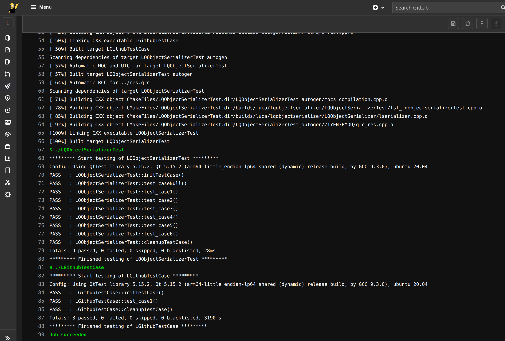

# Intro

The repo contains the code needed to create images to build and crossbuild Qt 5 and 6 for x64/arm64 Linux and armv7a/armv8a Android. This is useful, for instance, for continuous integration:



Articles with more info: https://bugfreeblog.duckdns.org/tag/docker-qt.

# Images

Images for some Qt versions are already available here:

* https://hub.docker.com/repository/docker/carlonluca/qt-builder
* https://hub.docker.com/repository/docker/carlonluca/qt-dev

The **qt-builder** is an image to be used to cross-build Qt itself for the available platforms. It includes all the headers and the libraries needed to build and crossbuild Qt from its sources. By using the build_* scripts, Qt tarballs are exported. The builder in docker hub is only built for the x64 architecture.

The **qt-dev** images are images that include prebuilt Qt installations. It includes all the deps needed to build and run Qt apps. This image is available for two archs in docker hub: the arm64 version only includes the arm64 build of Qt, the x64 version includes the x64 build and the Android builds.

# Qt Builder

Building the Qt builder is straightforward. This is a small changelog of the versions (referring to the tags):

* 1: first version that builds Qt < 6.2.0;
* 2: includes an updated cmake that builds Qt >= 6.2.0.

## Qt 5

To build Qt 5.x for x64:

```
docker run --rm -it --name qt-builder -v $PWD/qt_export:/root/export \
    -v $(pwd)/builder/build_amd64.sh:/build_amd64.sh carlonluca/qt-builder:focal \
    /build_amd64.sh 5.12.11 https://download.qt.io/official_releases/qt/5.12/5.12.11/single/
```

to build Qt 5.x for arm64:

```
docker run --rm -it --name qt-builder -v $PWD/qt_export:/root/export \
    -v $(pwd)/builder/build_aarch64.sh:/build_aarch64.sh carlonluca/qt-builder:focal \
    /build_aarch64.sh 5.12.11 https://download.qt.io/official_releases/qt/5.12/5.12.11/single/
```

## Qt 6

Qt 6 requires a different crossbuild procedure, so build both archs at the same time:

```
docker run --rm -it --name qt-builder -v $PWD/qt_export:/root/export \
    -v $(pwd)/builder/build_qt6.sh:/build_qt6.sh carlonluca/qt-builder:focal \
    /build_qt6.sh 6.1.2 https://download.qt.io/official_releases/qt/6.1/6.1.2/single/
```

# Qt Dev Image

Once packages are ready in the qt_export directory you can build the dev image.

## Qt 5

```
docker buildx build --push --platform linux/arm64/v8,linux/amd64 -t ... . -f Dockerfile_5.15.2
```

## Qt 6

```
docker buildx build --push --platform linux/arm64/v8,linux/amd64 --build-arg QTVER=6.1.2 -t ... -f Dockerfile_6.x .
```