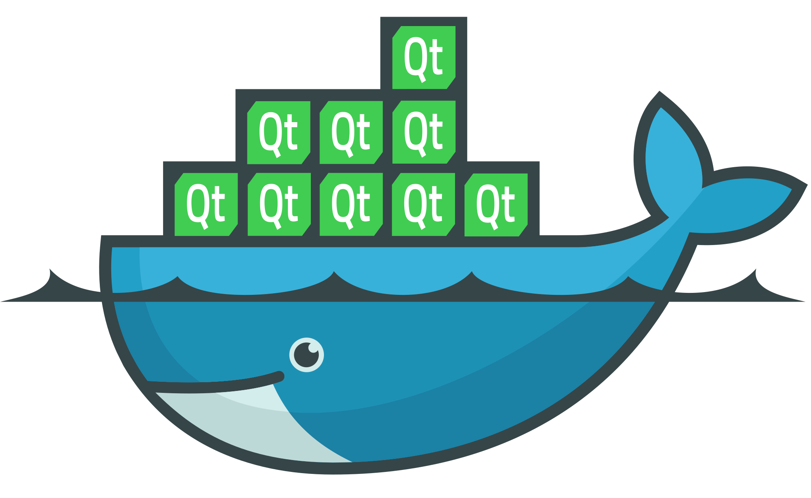

# Intro

The repo contains the code needed to create docker images to build and crossbuild Qt 5 and 6 and to build and crossbuild Qt based apps. This is useful to create images for continuous integration or to build for embedded devices.

Articles with more info: https://bugfreeblog.duckdns.org/tag/docker-qt.

Summary of all available images with the included features: https://bugfreeblog.duckdns.org/docker-qt-tags.




Qt can be built from the sources (this may need a lot of time) or can be downloaded from the Qt web server. Unfortuantely, Qt does not always keep all Qt versions, so it may not always be possible to download Qt, and rebuilding is the only chance.

# Images

Images for some Qt versions are already available here:

* https://hub.docker.com/r/carlonluca/qt-builder
* https://hub.docker.com/r/carlonluca/qt-dev

The **qt-builder** is an image to be used to cross-build Qt itself for the available platforms. It includes all the headers and the libraries needed to build and crossbuild Qt from its sources. By using the build_* scripts, Qt tarballs are exported. The builder in docker hub is only built for the x64 architecture. The arm builds are all created by crosscompiling.

The **qt-dev** images are images that include prebuilt Qt installations. They include all the deps needed to build and run Qt apps. These images available for two archs in docker hub: the arm64 version only includes the arm64 build of Qt, the x64 version includes the x64 build and the Android builds. NOTE: not all these images are identical, but the Qt installation is typically in /opt.

# Qt Builder

Before trying to build a Qt version, you'll need a proper builder image. The builder image includes all the deps needed to complete the build process. At the moment, I created two builders: one based on focal and one based on jammy. The one based on focal must be used to build Qt 5, the one based on jammy is used to build Qt 6.

Once the builder is available, you can use the builder to run the build of Qt itself. Refer to the build scripts at this point. Once the build script is done, you should find Qt packages available in the export directory. Those packages are used to create the dev images.

# Qt Dev Image

Once packages are ready in the export directory you can build the dev image. Use the dockerfiles in the root directory to build this image, according to the examples below.

Images evolved in time. In this page I try to keep track of images and of what each immage support: https://bugfreeblog.duckdns.org/docker-qt-tags.

## AppImage Builder

The images contain [appimage-builder](https://github.com/AppImageCrafters/appimage-builder) to ease creation of AppImage bundles.

> [!NOTE]  
> On noble based images (eg. Qt 6.8 and above) `appimage-builder` is installed inside a Python virtual env that can be activated with `. /venv/bin/activate`. Read more about using AppImages here https://bugfreeblog.duckdns.org/2023/09/qt-appimage.html.

## Qt 5

```
docker buildx build --push --platform linux/arm64/v8,linux/amd64 --build-arg QTVER=5.15.2 -t ... . -f Dockerfile_5.x .
```

## Qt 6

```
docker buildx build --push --platform linux/arm64/v8,linux/amd64 --build-arg QTVER=6.1.2 -t ... -f Dockerfile_6.x .
```